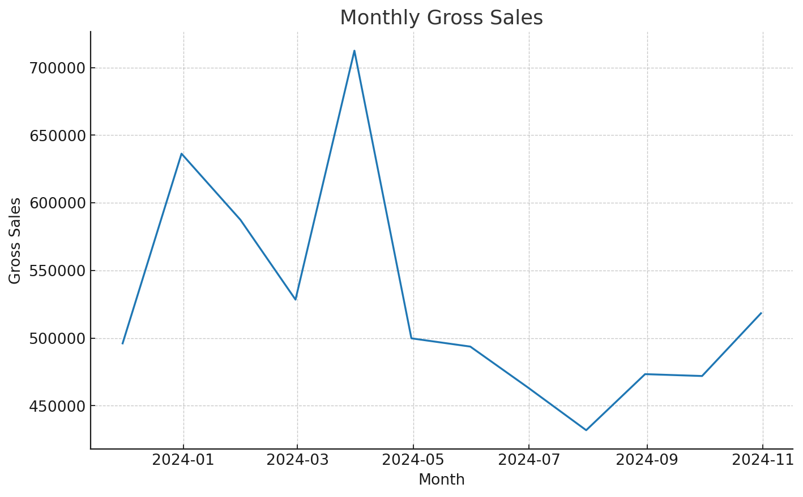
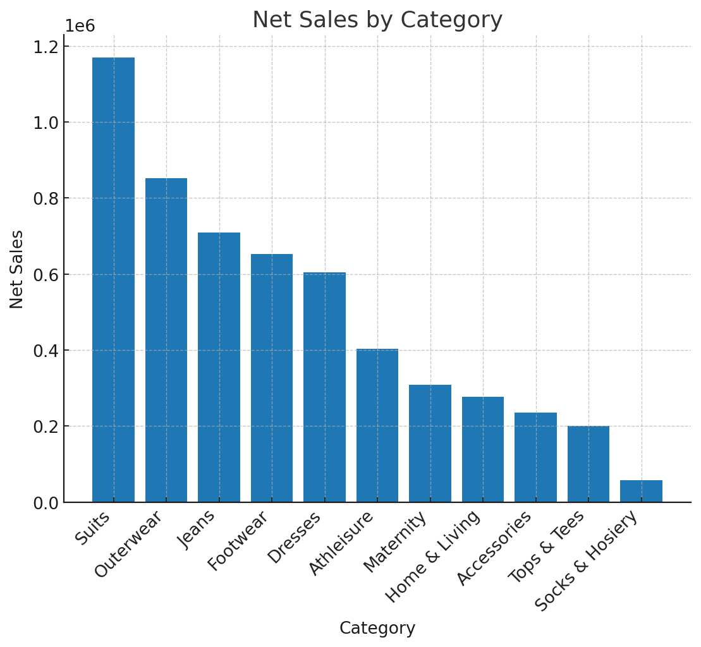
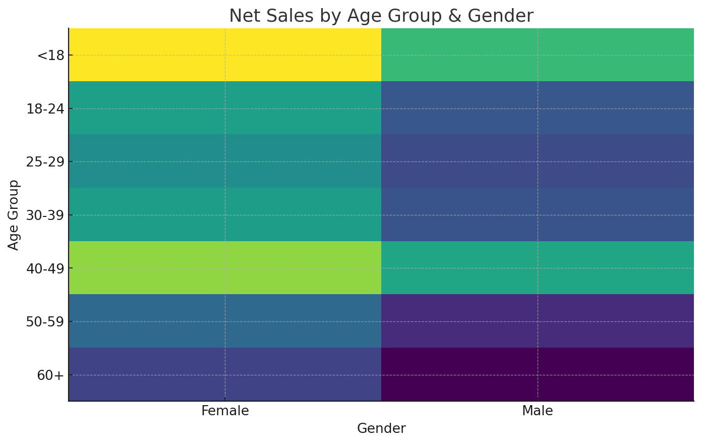
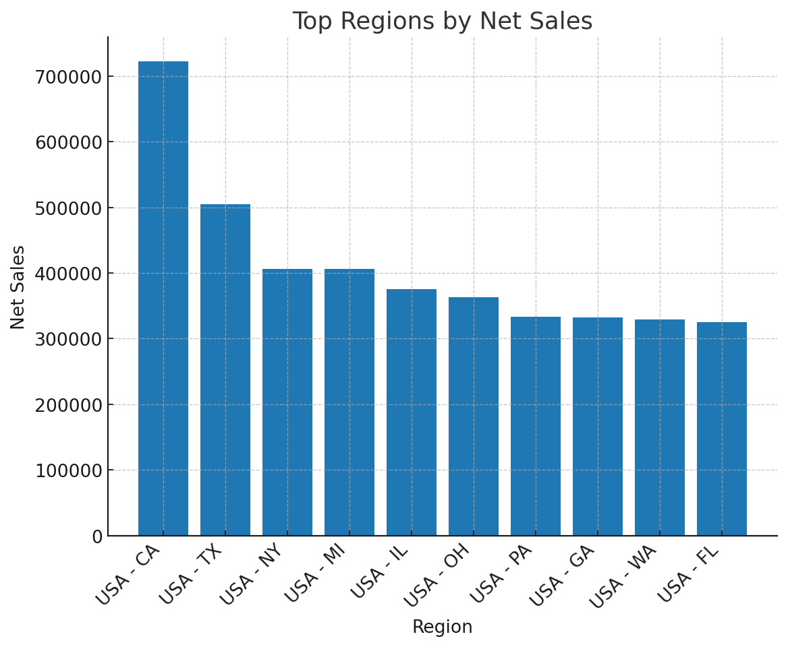

# PromoPilot: E-commerce Campaign Insights

_Data-driven playbook for campaign timing, targeting, and category focus._

**What you get**
- **Seasonality** → Acquisition kickoff **Nov/Dec → Mar** (peak in **Mar**); **Retention** in **Feb–Mar**; **Summer promos** to offset dip.
- **Segments** → Emphasis on **<18** and **40–49**; keep both genders in scope (female often leads net sales).
- **Categories** → Focus **Jeans, Accessories, Tops & Tees**; de-prioritize **Maternity, Suits, Socks & Hosiery**.
- **Regions** → USA tier states (**CA, TX, NY, IL, FL**) and UK cities (**Birmingham, Leeds, Leicester, Glasgow, Sheffield**).






## Quickstart

```bash
python -m venv .venv && source .venv/bin/activate   # Windows: .venv\Scripts\activate
pip install -r requirements.txt
streamlit run dashboard/app.py
```

## Structure

```
promopilot-ecommerce-insights/
├─ data/
│  └─ synthetic_orders_2023-11_to_2024-10.csv
├─ images/
│  ├─ monthly_gross_sales.png
│  ├─ category_net_sales.png
│  ├─ age_gender_matrix.png
│  └─ top_regions.png
├─ src/
│  └─ campaign.py
├─ dashboard/
│  └─ app.py
├─ notebooks/
│  └─ analysis.ipynb
├─ scripts/
│  └─ (optional utilities)
├─ LICENSE
├─ requirements.txt
├─ .gitignore
└─ README.md
```

## Talking Points

- **Timing:** Dec/Jan holiday lift and **March** peak → prime acquisition. **Feb–Mar** → retention nudges.
- **Who/What/Where:** Prioritize **<18 & 40–49**, **Jeans/Accessories/Tops**, and **US Tier-1 + key UK** regions.
- **Returns:** Track last-90d return rate KPI to guard margins.

MIT Licensed. PRs welcome.